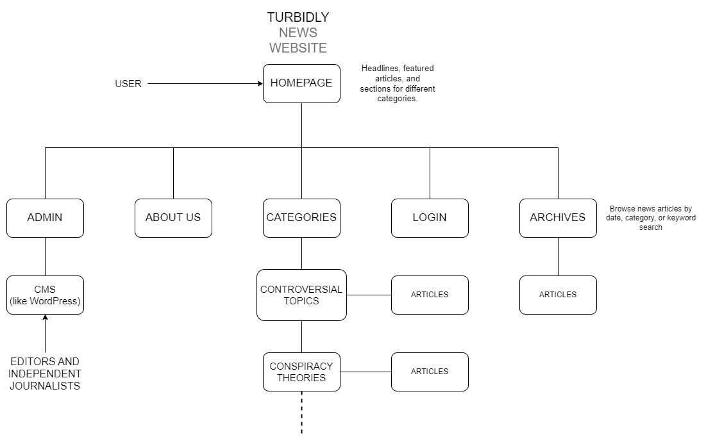
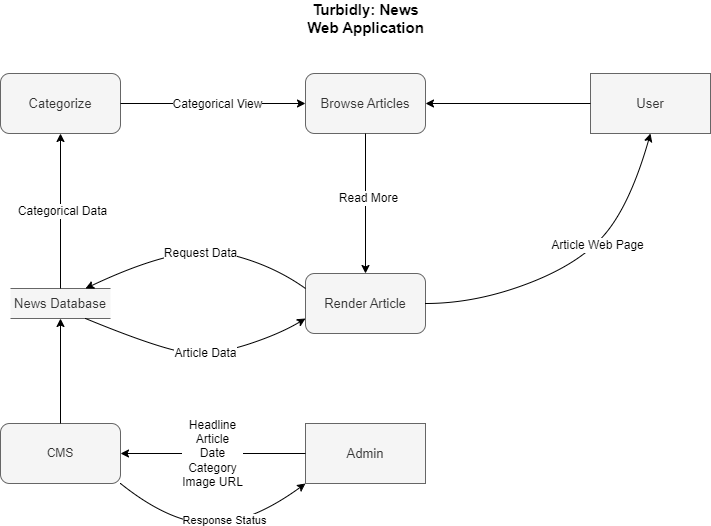
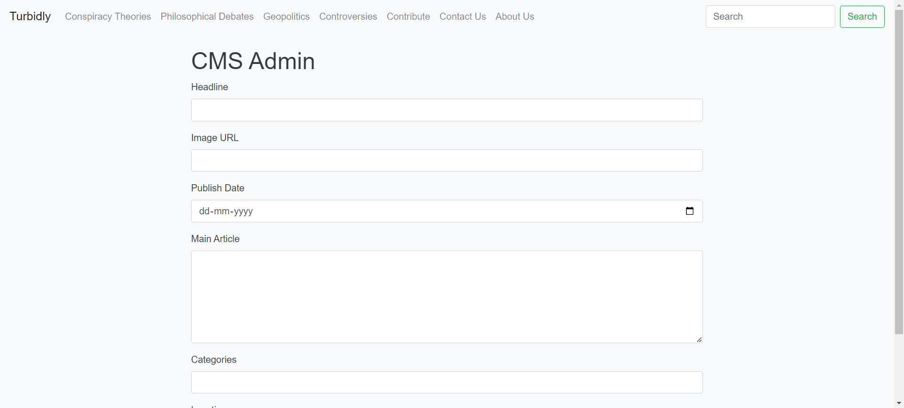
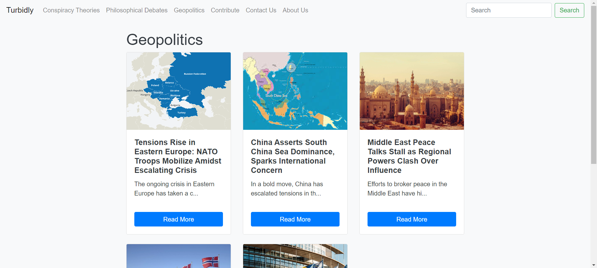

# Turbidly: News Web Application

Turbidly aims to provide users with a space to explore multiple perspectives on diverse topics, including conspiracy theories, philosophical debates, and geopolitics. The CMS (Content Management System) facilitates the creation, management, and publication of articles, enabling contributors to share their insights and analyses with the audience.

## Installation

**Clone the repository**:
```bash
git https://github.com/vardanskamra/turbidly
```

**Install the dependencies**:
```bash
cd turbidly
```

```bash
npm install
```

**Run the application**:
```bash
npm start
```

## Design and Architecture

- HTML and CSS are utilized for frontend design along with Bootstrap, providing a responsive and visually appealing user interface (UI) that adapts well to different screen sizes and devices.


- Node.js and Express.js are used for backend development, providing a robust and scalable platform for building RESTful APIs and handling server-side logic.


- MongoDB is used as the database management system (DBMS) for storing article data. Its flexibility and scalability make it well-suited for managing dynamic content.



## User Interface

- **Home Page**: Shows the latest and most relevant news


- **Content Management System**: Allows for seamless uploading of content to the website


- **Category Pages**: Turbidly deals with unique news genres like Geopolitics, Philosophy, Conspiracy Theories and many more


## License
This project is licensed under the MIT License - see the [LICENSE](LICENSE.txt) file for details.